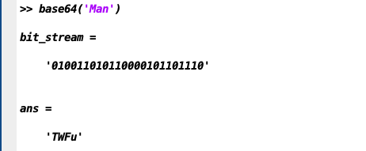

<!-- 标题：xxxx
作者及作者单位：xxx
摘要：xxx（研究目的，使用了什么方法，主要的结果结论是什么）
关键词：xxx（至少3个）
1、引言：研究问题的背景，目前前人研究的情况，针对这个问题还有哪些方面没有解决，我们从哪方面着手去做，应用什么方法
2、模型与方法
2-1、问题描述
2-2、数学模型
2-3、算法
3、结果与分析
4、结论
5、参考文献
6、附件
Matlab程序代码 -->

# MATLAB中实现base64加密算法

> base64作为一种基础的编码方式，应用十分广泛。尤其是在计算机领域当中，编码图片、信息加密等问题中都涉及到了base64编码算法。本文详述了base64编码的基本算法与规则，同时完成了在MATLAB语言环境下基于map和比特流等实现任意长度字符串base64加密功能，以及对其背后涉及的数学模型的分析。

<!-- USTB 42024203 -->

关键词：base64 信息加密 编码

## 引言

众所周知，base64是一种计算机领域中比较重要且实用的编码方式。在网络传输数据中，由于base64解码后的字符相比ASCII都是可见字符，使用base64编码可以减少不同机器对二进制文件解读的差异，降低这种出错的概率，因此，当今互联网中仍存在许多使用base64编码后交换的数据，如网站的根证书、电子邮件附件等。同时base64也可以作为一种较为简单的加密方式，用于网站传输或存储用户诸如密码这类关键信息等。

查阅相关资料后发现，base64在许多主流编程语言环境下都有比较成熟的实现，大多可以直接调用或依赖第三方库完成，然而很少有见到MATLAB环境下实现的base64编码或加密算法，下文详述了我在MATLAB中实现base64编码字符串的过程。

## 模型与方法

### 问题描述

在分析模型和设计方法前首先应了解base64编码的基本方式。首先base64规定了包含64组内容的索引表，索引表中每个字符都对应0~63中一个唯一的数字，base64也因此得名，表一是base64的索引表。

> 表1

|  Index  | Binary | Char |      | Index  | Binary | Char |        | Index | Binary |  Char  |      |
| :-----: | :----: | :--: | :--: | :----: | :----: | :--: | :----: | :---: | :----: | :----: | :--: |
|    0    | 000000 | `A`  |  16  | 010000 |  `Q`   |  32  | 100000 |  `g`  |   48   | 110000 | `w`  |
|    1    | 000001 | `B`  |  17  | 010001 |  `R`   |  33  | 100001 |  `h`  |   49   | 110001 | `x`  |
|    2    | 000010 | `C`  |  18  | 010010 |  `S`   |  34  | 100010 |  `i`  |   50   | 110010 | `y`  |
|    3    | 000011 | `D`  |  19  | 010011 |  `T`   |  35  | 100011 |  `j`  |   51   | 110011 | `z`  |
|    4    | 000100 | `E`  |  20  | 010100 |  `U`   |  36  | 100100 |  `k`  |   52   | 110100 | `0`  |
|    5    | 000101 | `F`  |  21  | 010101 |  `V`   |  37  | 100101 |  `l`  |   53   | 110101 | `1`  |
|    6    | 000110 | `G`  |  22  | 010110 |  `W`   |  38  | 100110 |  `m`  |   54   | 110110 | `2`  |
|    7    | 000111 | `H`  |  23  | 010111 |  `X`   |  39  | 100111 |  `n`  |   55   | 110111 | `3`  |
|    8    | 001000 | `I`  |  24  | 011000 |  `Y`   |  40  | 101000 |  `o`  |   56   | 111000 | `4`  |
|    9    | 001001 | `J`  |  25  | 011001 |  `Z`   |  41  | 101001 |  `p`  |   57   | 111001 | `5`  |
|   10    | 001010 | `K`  |  26  | 011010 |  `a`   |  42  | 101010 |  `q`  |   58   | 111010 | `6`  |
|   11    | 001011 | `L`  |  27  | 011011 |  `b`   |  43  | 101011 |  `r`  |   59   | 111011 | `7`  |
|   12    | 001100 | `M`  |  28  | 011100 |  `c`   |  44  | 101100 |  `s`  |   60   | 111100 | `8`  |
|   13    | 001101 | `N`  |  29  | 011101 |  `d`   |  45  | 101101 |  `t`  |   61   | 111101 | `9`  |
|   14    | 001110 | `O`  |  30  | 011110 |  `e`   |  46  | 101110 |  `u`  |   62   | 111110 | `+`  |
|   15    | 001111 | `P`  |  31  | 011111 |  `f`   |  47  | 101111 |  `v`  |   63   | 111111 | `/`  |
| Padding |   =    |      |      |        |        |      |        |       |        |        |      |

以编码字符串为例，首先需要将字符串根据ASCII码转化为每个字符8位长的二进制数，组合成一段二进制比特流，同时，由于base64编码的要求，所得到的的二进制流位数必须是24的倍数，如不足则在低位补0直至达到要求，这样就得到了原始字符串的二进制形式。随后将这个二进制数字每6位一组从高位向低位拆分，得到的二进制数转化成十进制后根据base64的索引表可以获得其对应的base64编码下的字符，同时，如果拆分的到的某六位二进制数实际上没有一位包含在原始字符串的ASCII二进制串中，则使用占位符=而非索引中的字符表示这一二进制数。按照以上规则，将所有二进制数转化完成后得到的字符串就是原始字符串base64编码后的字符串。

分析至此，我们的问题可以描述为：将一个二进制数通过移位等操作，扩展为位数为24倍数的新二进制数，然后将其从高位到低位每6位进行取出，根据索引表一一映射出base64字符。


### 数学模型

首先，表一中的索引表实际上是一个函数，自变量是索引值，函数值是字符，自变量定义域是[0,63]中的整数， 值域是base64编码下64种字符。

其次，解决base64编码的关键是如何将任意位数的二进制数扩展为位数是24的倍数的二进制数，如果设原来位数为x，需要扩展的位数为y，则有
> 公式一

$$
mod(x+y, 24) = 0
$$


求出上式中y的最小值即可，同时也要注意占位符的起始点，设占位起始位数（令高位是0，从高位向低位递增）为z，原始字符串长度（字符个数）为len，则
> 公式二

$$
mod(len\times 8-z, 6) = 0
mod(len, 8) = 0
z>len
$$
求出满足上述关系的最小z即可。


### 算法

将原始二进制数位数不断加1，同时在二进制数后同步增加0，如果此时二进制数位数满足上述公式2，则记录当前二进制数长度为z，如果满足上述公式1，则退出循环。

在MATLAB中，我们适当做了一些修改，将二进制串用字符串表示方便添加0和计算位数


## 结果与分析

程序完成后封装成了函数，命名为base64。首先以Man为例进行测试，Man的原始二进制串为01001101 01100001 01101110恰好为24位，同时是6、8、24的倍数，在base64编码中会变为010011 010110 000101 101110这样的四组，因此我们的答案不会有占位符，此用例可以用于简单的映射验证，程序得到结果如下




和base64官方网站提供的编码工具对比后结果一致，说明程序正确。

之后我们删减一个字符，使用Ma作为测试，观察程序能否正常进行补位。Ma的原始二进制串为01001101 01100001，此时base64算法会首先补位至位数为64的倍数，随后拆分，会读到010011 010110 0001（00 000000）这样的序列（括弧内是补位的0），那么我们判断，最后一组不应该使用映射表中0的索引值，而是占位符，得到的base64编码最后一个字符应该为占位符=，随后我们将运行结果和分析与base64官方工具给出的结果进行比对，发现全部正确。


以上已经测试完了所有算法，接下来试着编码一个更完整、更有实际意义的字符串‘I LOVE MATLAB, I LOVE MATH!’，比对结果后发现完全正确，我们实现的函数可以用于更复杂的实际问题中。


## 结论

通过MATLAB语言成功实现了任意长度字符串的base64编码，结果正确，函数运行稳定，可以用于实际复杂的问题当中。

## 参考文献

[[1]Wikipedia contributors,Base64[DB/OL].Wikipedia, The Free Encyclopedia,2022(6):https://en.wikipedia.org/wiki/Base64](https://en.wikipedia.org/wiki/Base64)

[[2]唐武生,田立红,曹伟.Base64编码的实现与应用研究[J].长春大学学报,2006(04):69-72.](https://kns.cnki.net/kcms/detail/detail.aspx?dbcode=CJFD&dbname=CJFD2006&filename=CDXB200604018&uniplatform=NZKPT&v=vhK47lJ-_0qnmYdqhcwuWm5BTgqhBZnXwzCljMk6-d4Xkl0h8beCGdqdvtCylNZ5)

## 附件

### MATLAB程序源代码
```MATLAB
function output = base64(my_string)

    % 初始化base64加密的映射图, 左边为比特流中的十进制形式, 右边为对应的ASCII字符
    base64map = containers.Map({0, 1, 2, 3, 4, 5, 6, 7, 8, 9, 10, 11, 12, 13, 14, 15, 16, 17, 18, 19, 20, 21, 22, 23, 24, 25, 26, 27, 28, 29, 30, 31, 32, 33, 34, 35, 36, 37, 38, 39, 40, 41, 42, 43, 44, 45, 46, 47, 48, 49, 50, 51, 52, 53, 54, 55, 56, 57, 58, 59, 60, 61, 62, 63, 64}, {'A', 'B', 'C', 'D', 'E', 'F', 'G', 'H', 'I', 'J', 'K', 'L', 'M', 'N', 'O', 'P', 'Q', 'R', 'S', 'T', 'U', 'V', 'W', 'X', 'Y', 'Z', 'a', 'b', 'c', 'd', 'e', 'f', 'g', 'h', 'i', 'j', 'k', 'l', 'm', 'n', 'o', 'p', 'q', 'r', 's', 't', 'u', 'v', 'w', 'x', 'y', 'z', '0', '1', '2', '3', '4', '5', '6', '7', '8', '9', '+', '/', '=' });
    % 初始化加密后字符串
    ans = '';
    % 获取输入字符串长度
    len = size(my_string);
    % 将字符串转换成ASCII码
    ascii_codes=double(my_string);
    [row, col ] = size(ascii_codes);
    % 将十进制ASCII码转换为二进制比特流
    ascii = 0;
    bit_stream = '';
    for i = 1:col
        bit_stream = [bit_stream, dec2bin(ascii_codes(i), 8)];
    end
    [row, col] = size(bit_stream);

    % 将比特流补全至24的倍数, 并计算空位起点
    fill_start = col;
    fill_start_setted = 0;
    while not (mod(col, 24) == 0)
        if not (fill_start_setted == 1)
            if (mod(col, 8) == 0 && (col / 8) > len(1)*8) 
                fill_start = col;
                fill_start_setted = 1;
            end
        end
        bit_stream = [bit_stream, '0'];
        [rol, col] = size(bit_stream);
    end

    % 打印补全后的比特流
    bit_stream

    % 将比特流中数据每6位一提取并转换成base64码
    loop_time = col / 6;
    for i = 1:loop_time
        if (6*(i-1)+1) >= fill_start
            % 到达补全位, 使用字符'='补全, 而不再使用映射
            ans = [ans,'='];
        else    
            ans = [ans, base64map(bin2dec(bit_stream(6*(i-1)+1 :6*i)))];
        end
    end

    % 打印base64加密后的结果
    ans
end
```

